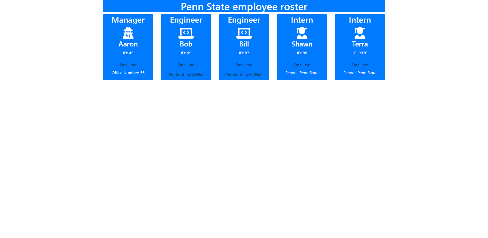

# team_portfolio_generator
## Description
- What was your motivation? I wanted to make this project to increase my skills in node.js. 
- Why did you build this project? I built this project to support a company that wants to have a nice presentation for its employees and their job titles. 
- What problem does it solve? This project solves the issue for large companies to a nice presentation of their employees and their emails and github accounts. 
- What did you learn? Doing this project I learned alot about how to test my projects. Secondly I also learned how to use constructors and continue to re-use those data in different parts of the project. 
## Table of Contents
- [Installation](#installation)
- [Usage](#usage)
- [Credits](#credits)
- [License](#license)
## Installation
What are the steps required to install your project? node.js is required to run this project. As well as jest. from the command line your can input npm install and it will install all the required dependencies. 
## Usage 

## Credits
For this project I leaned heavily on my tutor. I was able to get the majority of my code completed and he seriously helped me out with structure and pulling the data from my arrays.
## License
- MIT License

Copyright (c) [2021] [Aaron Donelson]

Permission is hereby granted, free of charge, to any person obtaining a copy of this software and associated documentation files (the "Software"), to deal in the Software without restriction, including without limitation the rights to use, copy, modify, merge, publish, distribute, sublicense, and/or sell copies of the Software, and to permit persons to whom the Software is furnished to do so, subject to the following conditions:

The above copyright notice and this permission notice shall be included in all copies or substantial portions of the Software.

THE SOFTWARE IS PROVIDED "AS IS", WITHOUT WARRANTY OF ANY KIND, EXPRESS OR IMPLIED, INCLUDING BUT NOT LIMITED TO THE WARRANTIES OF MERCHANTABILITY, FITNESS FOR A PARTICULAR PURPOSE AND NONINFRINGEMENT. IN NO EVENT SHALL THE AUTHORS OR COPYRIGHT HOLDERS BE LIABLE FOR ANY CLAIM, DAMAGES OR OTHER LIABILITY, WHETHER IN AN ACTION OF CONTRACT, TORT OR OTHERWISE, ARISING FROM, OUT OF OR IN CONNECTION WITH THE SOFTWARE OR THE USE OR OTHER DEALINGS IN THE SOFTWARE.

## Badges

## Tests
To test this project you can open your terminal instance on any of the .test.js files. Type in npm test and press enter. This will show that the logit in the index.js file is working properly.